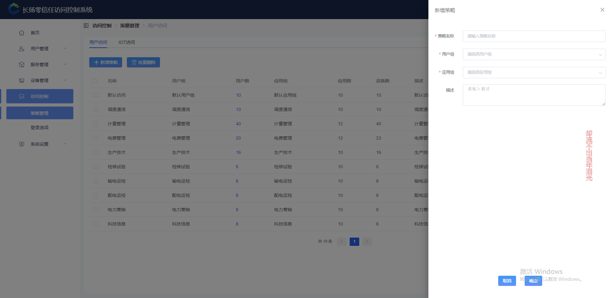
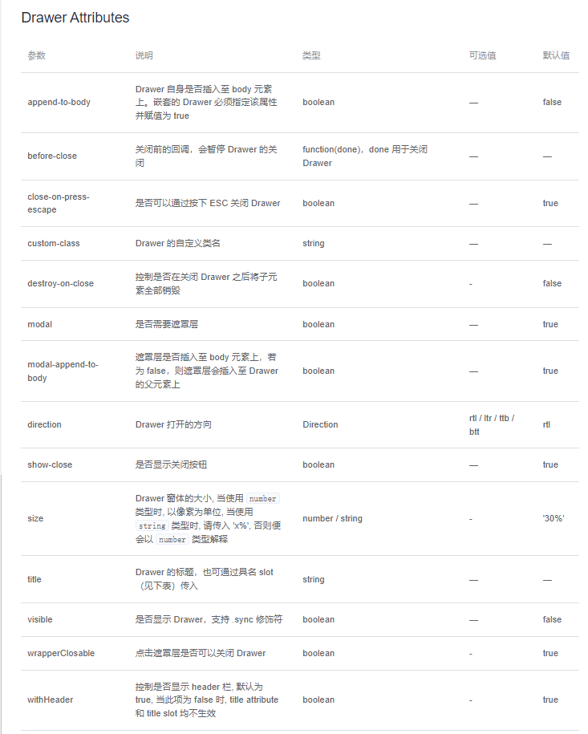

# drawer抽屉组件使用手册
#### 图例
基于element-ui中el-drawer的二次内容封装：


#### 调用说明


```
  <new-drawer ref="drawer" @sure="handle('sure')" @close="handle('close')">
    <el-form
      ref="form"
      label-width="auto"
      :model="form"
      size="small"
      :rules="rules"
      @submit.native.prevent
    >
      <el-form-item label="策略名称" prop="strategyName">
        <el-input
          v-model="form.strategyName"
          placeholder="请输入策略名称"
          maxlength="256"
        ></el-input>
      </el-form-item>
    </el-form>
  </new-drawer>
```

#### 参数说明
支持全部原生属性：https://element.eleme.cn/#/zh-CN/component/drawer

自定义参数

| 参数    | 说明       |  类型   | 默认值 |
| :------ | :--------- | :-----: | :----- |
| buttons | 默认按钮组 | boolean | true   |

#### 自定义事件说明

| 事件名称     | 说明                           | 参数      |
| :----------- | :----------------------------- | :-------- |
| show         | 显示抽屉                       | 抽屉title |
| close        | 关闭抽屉，并触发绑定emit:close |           |
| sure         | 确定按钮，并触发绑定emit:sure  |           |
| loading      | 确定按钮loading样式            |           |
| closeLoading | 取消确定按钮loading样式        |           |
