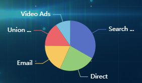

# 饼状图使用手册

### 使用说明
当前封装为简单封装，只针对一个饼状图




代码片段：

```
// html片段
<div id="left-center"></div>

// 引入
import Pie from "@/assets/js/echarts/pie";

// js片段
this.myChart = new Pie("left-center", {
  data: [
    { value: 1048, name: "Search Engine" },
    { value: 735, name: "Direct" },
    { value: 580, name: "Email" },
    { value: 484, name: "Union Ads" },
    { value: 300, name: "Video Ads" },
  ],
  mode: "dark",
  click: (param) => {
    console.log(param);
  },
});

```

### 参数说明

| 参数    | 说明                              |  类型  | 默认值 |
| :------ | :-------------------------------- | :----: | :----: |
| divId   | DOM元素id                         | string |
| options | 配置项，具体配置见options参数说明 | object |

### options参数说明


| 参数  | 说明                                      |   类型   | 默认值 |     可选值      |
| :---- | :---------------------------------------- | :------: | :----: | :-------------: |
| data  | 传入数据，数据格式见使用说明              |  array   |   []   |
| mode  | 背景模式                                  |  string  | 'dark' | 'dark', 'white' |
| click | pie点击事件回调函数, 一个参数（点击元素） | function |
| theme | 主题色                                    |  string  |


### 内置方法

| 方法       | 说明                            |
| :--------- | :------------------------------ |
| updateData | 更新数据，参数为更新数据        |
| clear      | 清除canvas，dom元素，resize事件 |

```
// 更新数据
this.myChart.updateData([{name: 'test', value: 123}])

// 清除
this.myChart.clear()
```

### 说明

1、新建Pie类后，自动绑定window.resize事件。
2、vue路由切换后，应手动清除echarts（调用clear方法），防止内存泄漏。